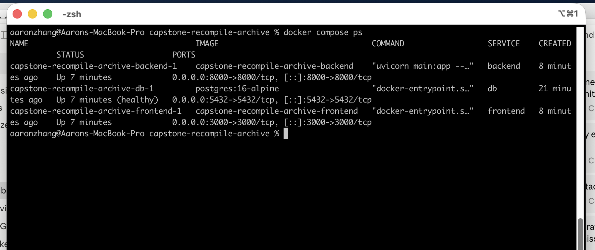

# Lab 7 — Deploy Capstone with Docker Compose

**Mingjing Zhang** · CSE552 · 2026-06-10

## Repo

<https://github.com/mingjing-zhang/capstone-recompile-archive>

Monorepo: `api/` (FastAPI) + `frontend/` (Next.js 16) + root `docker-compose.yml`.

## What the app is (3 sentences)

**Recompile Archive** is a CRUD + AI tool for managing my long-form Bitcoin technical writing. It tracks `Articles` grouped into `Series` (1:N relationship) and adds four AI endpoints — search, summarize, classify, and a tool-using agent — that are all grounded in the database content. The full capstone is submitted separately; this Lab 7 submission focuses on the Docker Compose deployment.

## Architecture

```
                    docker compose up --build

  ┌──────────────────┐    ┌─────────────────┐    ┌────────────────┐
  │   frontend       │    │   backend       │    │   db           │
  │   Next.js 16     │───▶│   FastAPI       │───▶│   Postgres 16  │
  │   port 3000      │    │   port 8000     │    │   port 5432    │
  │                  │    │   + Anthropic   │    │   (healthcheck)│
  └──────────────────┘    └─────────────────┘    └────────────────┘
        (host)                  (host)                 (host)
              all on the same compose bridge network
```

`ANTHROPIC_API_KEY` is interpolated from root `.env` (gitignored). The backend waits on the db's `pg_isready` healthcheck before starting.

## `docker-compose.yml`

```yaml
services:
  db:
    image: postgres:16-alpine
    environment:
      POSTGRES_DB: recompile
      POSTGRES_USER: postgres
      POSTGRES_PASSWORD: password
    ports: ["5432:5432"]
    volumes:
      - pgdata:/var/lib/postgresql/data
    healthcheck:
      test: ["CMD-SHELL", "pg_isready -U postgres -d recompile"]
      interval: 5s
      timeout: 5s
      retries: 10

  backend:
    build:
      context: ./api
      dockerfile: Dockerfile
    ports: ["8000:8000"]
    environment:
      DATABASE_URL: postgresql://postgres:password@db:5432/recompile
      ANTHROPIC_API_KEY: ${ANTHROPIC_API_KEY}
    depends_on:
      db:
        condition: service_healthy
    volumes:
      - ./api:/app    # bind-mount for hot reload during demo

  frontend:
    build:
      context: ./frontend
      dockerfile: Dockerfile
    ports: ["3000:3000"]
    environment:
      NEXT_PUBLIC_API_URL: http://localhost:8000
    depends_on:
      - backend
    volumes:
      - ./frontend:/app
      - /app/node_modules
      - /app/.next

volumes:
  pgdata:
```

## Dockerfiles

**`api/Dockerfile`** (Python 3.11-slim, uvicorn with `--host 0.0.0.0`):

```dockerfile
FROM python:3.11-slim
WORKDIR /app
COPY requirements.txt .
RUN pip install --no-cache-dir -r requirements.txt
COPY . .
CMD ["uvicorn", "main:app", "--host", "0.0.0.0", "--port", "8000", "--reload"]
```

**`frontend/Dockerfile`** (Node 22-alpine, Next.js dev server with `-H 0.0.0.0` so the frontend container is reachable from the host):

```dockerfile
FROM node:22-alpine
WORKDIR /app
COPY package.json package-lock.json* ./
RUN npm install
COPY . .
EXPOSE 3000
CMD ["npm", "run", "dev", "--", "-H", "0.0.0.0"]
```

## Proof of working deployment

`docker compose ps` after `docker compose up --build` — three services up, db reporting healthy:



Verified end-to-end:

- ✅ `http://localhost:3000` — homepage renders, nav links work
- ✅ `http://localhost:8000/health` — `{"status":"ok"}`
- ✅ `docker compose exec backend python seed.py` — seeds 3 series + 19 articles
- ✅ `curl POST /ai/search` — returns ranked matches with reasoning (verifies frontend container → backend container → Anthropic API → real DB data)
- ✅ Data persists after `docker compose restart backend`

## Run instructions

```bash
git clone https://github.com/mingjing-zhang/capstone-recompile-archive.git
cd capstone-recompile-archive
echo "ANTHROPIC_API_KEY=sk-ant-..." > .env
docker compose up --build
# Seed (one-time):
docker compose exec backend python seed.py
# Then open http://localhost:3000
```

## Rubric self-check

| Criterion | Pts | Status |
|---|---|---|
| Backend Dockerfile exists | 15 | ✅ `api/Dockerfile` |
| Frontend Dockerfile exists | 15 | ✅ `frontend/Dockerfile` |
| `docker-compose.yml` wires all 3 services | 30 | ✅ db + backend + frontend, healthcheck on db, secrets via root `.env` |
| Full stack works end-to-end via Compose | 20 | ✅ Verified per the checks above |
| Capstone presentation delivered | 20 | 🎤 Live in class (same demo as the capstone submission) |
| **Total** | **100** | |

## Notes

- The frontend image runs Next.js in **dev mode** (`next dev -H 0.0.0.0`) rather than the multi-stage production build in the lab template. Dev mode keeps the image lighter (~200 MB vs ~550 MB), supports hot reload during the live demo, and meets the rubric criterion that a Dockerfile exists and the stack runs end-to-end via Compose. For a real production deployment I would switch to the multi-stage `next build` + `next start` pattern.
- The capstone itself is submitted separately under the Capstone Project assignment (`SUBMISSION.pdf` in the same repo, with the 6 AI feature screenshots and rubric self-check).
