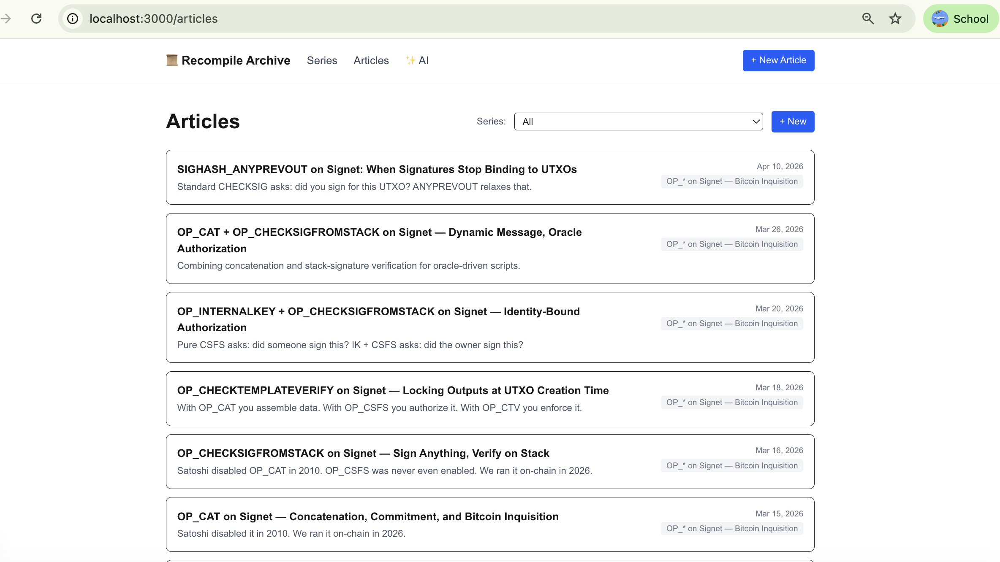
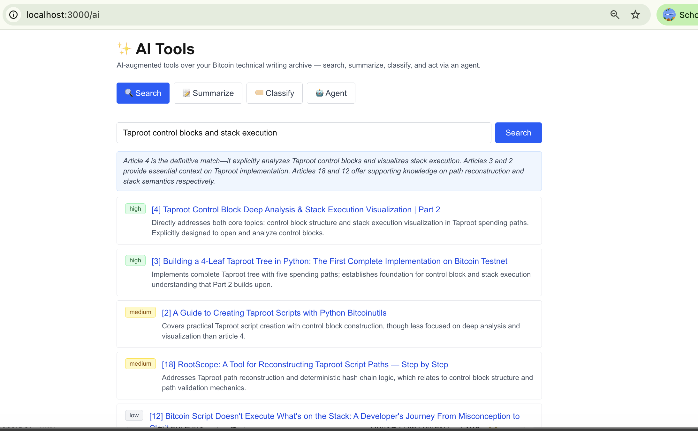
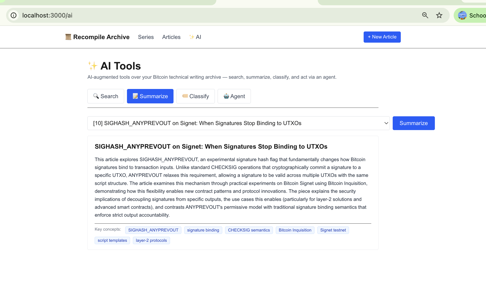
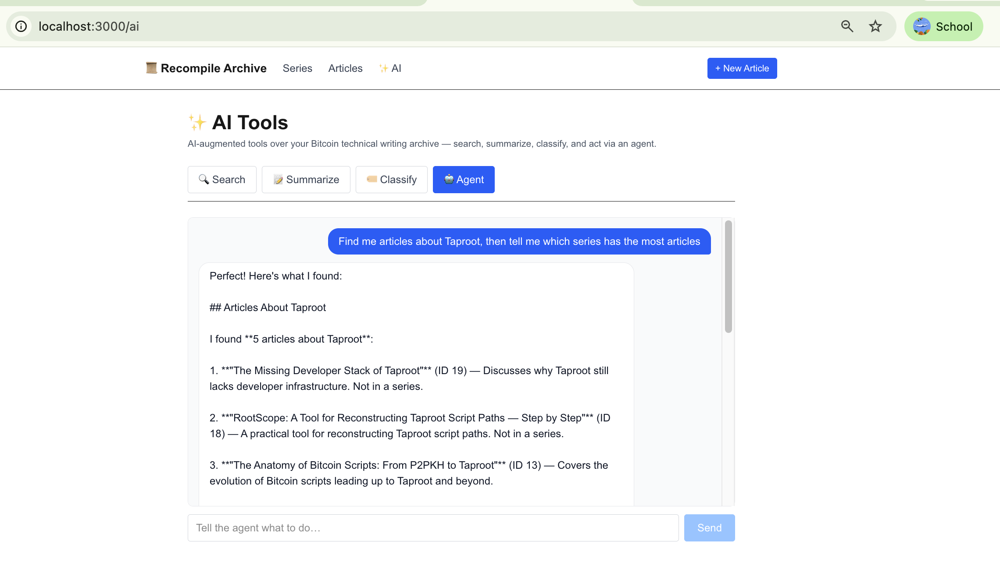
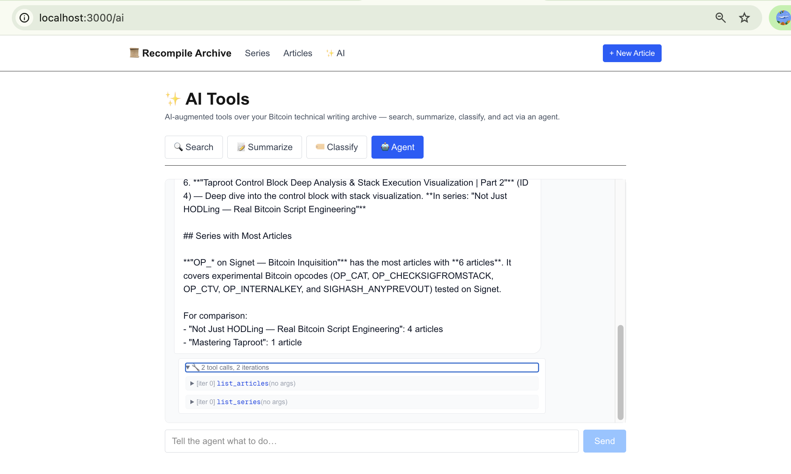

# Capstone — Recompile Archive

**An AI-augmented archive for Bitcoin technical writing.**

Mingjing Zhang · CSE552 · 2026-06-10

## Repo

**<https://github.com/mingjing-zhang/capstone-recompile-archive>** (monorepo: `api/` + `frontend/` + root `docker-compose.yml`). Public. `.env` gitignored, contains only `ANTHROPIC_API_KEY`.

Run locally:

```bash
git clone https://github.com/mingjing-zhang/capstone-recompile-archive.git
cd capstone-recompile-archive
echo "ANTHROPIC_API_KEY=sk-ant-..." > .env
docker compose up --build
# Frontend → http://localhost:3000
# Backend  → http://localhost:8000  (Swagger /docs)
# Seed     → docker compose exec backend python seed.py
```

## What it is

A personal archive for the kind of long-form Bitcoin protocol writing I do at `@aaron.recompile` on Medium — series like *"Not Just HODLing — Real Bitcoin Script Engineering"* and *"OP_* on Signet — Bitcoin Inquisition"*. The CRUD half lets me file articles under series; the AI half makes the archive actually *useful* by letting me search by topic, summarize on demand, classify new drafts, and run multi-step natural-language commands against my own writing.

## Architecture

```
Next.js 16 (frontend)  ←→  FastAPI (backend)  ←→  Postgres 16
   /, /series, /articles,        15 endpoints:           Series ←── Article
   /articles/new, /ai            12 CRUD + 4 AI              (1:N FK)
                                       │
                                       └─→  Claude (Haiku 4.5)
                                            via Anthropic SDK
```

- **Two related models** with a real foreign key (`Article.series_id → Series.id`, `Series.articles` back-populated, cascade delete).
- **15 endpoints**: 12 standard CRUD across both resources, plus 4 AI endpoints.
- **4 AI endpoints**, each grounded in DB content (not generic LLM chat):
  - `POST /ai/search` — natural-language query → ranked articles with per-match `why_relevant` reasoning.
  - `POST /ai/summarize` — article id → 150–200 word summary + 3–5 key concept tags.
  - `POST /ai/classify` — candidate title/subtitle → suggested series + confidence + alternatives.
  - `POST /ai/agent` — 6-tool agent loop (list/get articles + series, create + update articles), returns `response`, `agent_steps`, `iterations`.
- **Docker**: `api/Dockerfile`, `frontend/Dockerfile`, root `docker-compose.yml` wiring all three services. Postgres healthcheck before backend starts. `ANTHROPIC_API_KEY` interpolated from root `.env`.

## Screenshots

### 1. Homepage


### 2. Articles list (CRUD)

Standard CRUD UI over the `Article` table. Click any title to read; `+ New` to create.



### 3. AI Search

Query: *"Taproot control blocks and stack execution."* The endpoint returns 5 ranked matches with explicit `relevance` tags (`high` / `medium` / `low`) and a per-result `why_relevant` sentence. Each result links to the underlying article page.



### 4. AI Summarize

Pick *[10] SIGHASH_ANYPREVOUT on Signet…* from the dropdown → get a 200-word expanded summary plus 8 key concept chips (*SIGHASH_ANYPREVOUT, signature binding, CHECKSIG semantics, Bitcoin Inquisition, Signet testnet, script templates, layer-2 protocols*).



### 5 + 6. AI Agent (multi-step tool use)

Request: *"Find me articles about Taproot, then tell me which series has the most articles."* The agent calls `list_articles({})` and `list_series({})` in **parallel** during iteration 0, then synthesizes a single answer — listing the 5 matching Taproot articles AND naming *OP_\* on Signet — Bitcoin Inquisition* as the largest series (6 articles).



Expanding the `🔧 2 tool calls, 2 iterations` accordion reveals the actual tool calls the model made:



This is the same `tool_use` loop pattern from Lab 6, retargeted at `Article`/`Series` instead of `Book`. The 6 tools are: `list_articles`, `get_article`, `list_series`, `get_series`, `create_article`, `update_article`.

## Technical highlight

**The 6-tool agent in `api/agent.py` is the centerpiece.** It's a vanilla Anthropic `tool_use` loop (max 10 iterations, structured `agent_steps` log), but the tool *descriptions* are doing the heavy lifting — they explicitly tell the model: *"if the user refers to an article by title, look up the id with `list_articles` first; don't fabricate ids."* That single sentence is what produces the right behavior on Test 4 multi-step requests like the one above. The same lesson from Lab 6 reflection Q3 lands here verbatim: bad tool descriptions don't crash, they cause quiet data corruption.

**Grounding, not chat.** All four AI endpoints inject real DB content into the system prompt before each call. `/ai/search` lists every article (id + title + subtitle + series) inline in the system prompt; the model can only return ids that actually exist. `/ai/recommend`-style hallucinations of fake book titles (the failure mode I called out in the Lab 5 reflection) are structurally impossible here, because the model is looking at the actual list every turn.

## Rubric self-check

| Criterion | Pts | Status |
|---|---|---|
| **Functionality** | | |
| Core CRUD works in production | 15 | ✅ Series + Article CRUD via REST + UI |
| AI feature is meaningful & uses app data | 20 | ✅ 4 endpoints, each grounded in DB; see screenshots 3–6 |
| All major flows work without errors | 10 | ✅ Verified end-to-end (uvicorn + npm dev today; `docker compose up --build` for live demo) |
| **Technical Quality** | | |
| Frontend: Next.js, multi-page, responsive | 10 | ✅ Next.js 16, 5+ routes (`/`, `/series`, `/series/[id]`, `/articles`, `/articles/[id]`, `/articles/new`, `/ai`) |
| Backend: FastAPI, 2+ models, organized code | 10 | ✅ FastAPI, `Series` + `Article` w/ FK, code split across `main.py` + `agent.py` + `schemas.py` |
| Database: Postgres, persists across restarts | 5 | ✅ Postgres 16 in Docker; `pgdata` volume |
| AI: Claude API integrated thoughtfully | 10 | ✅ 3 structured-output endpoints (JSON schema enforced) + 1 tool-use agent; Haiku 4.5 for cost |
| Docker: Dockerfiles + compose, starts clean | 5 | ✅ `api/Dockerfile`, `frontend/Dockerfile`, root `docker-compose.yml` with healthcheck on db |
| **Presentation (live in class)** | | |
| Live demo via `docker compose up` | 5 | Live in class |
| Clear explanation of problem & solution | 5 | Live in class |
| Technical highlight clearly explained | 5 | Live in class |
| **Total** | **100** | |

## Notes

- **Model**: `claude-haiku-4-5` (~$1/M in + $5/M out, roughly 3× cheaper than Sonnet for this workload). Total Anthropic spend across all dev + testing: **< $0.05**.
- **Code reuse**: builds on Mini Project 2 (`Series`/`Article` CRUD). The 4 AI endpoints + agent + AI UI are new this capstone. Same identity hygiene as prior labs (`mingjing-zhang/` GitHub, `.env` gitignored, no secrets in history).
- **What `docker compose up` builds**: Postgres 16 (image), backend (Python 3.11 + uvicorn + anthropic + sqlalchemy), frontend (Node 22 + Next.js 16 dev server). All three start with one command.
